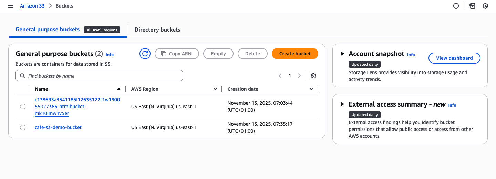
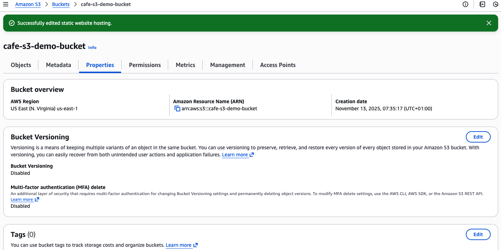
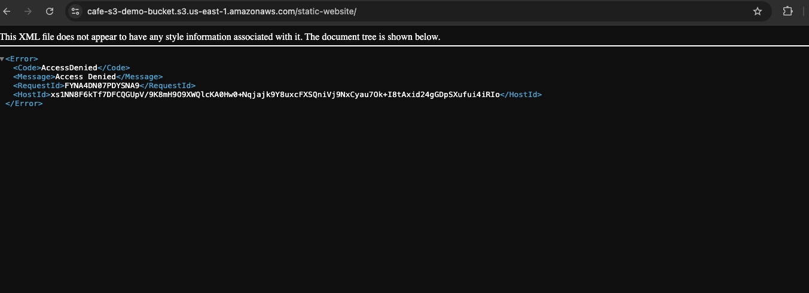
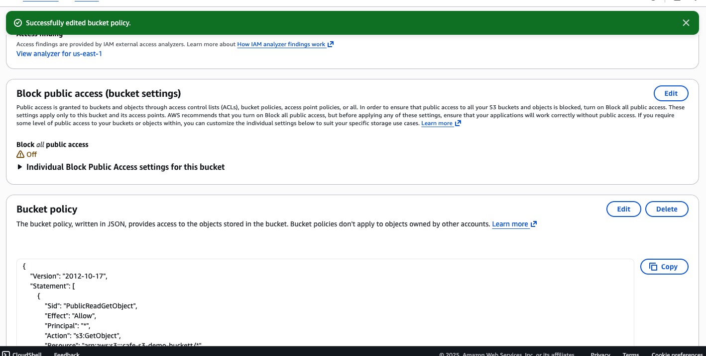
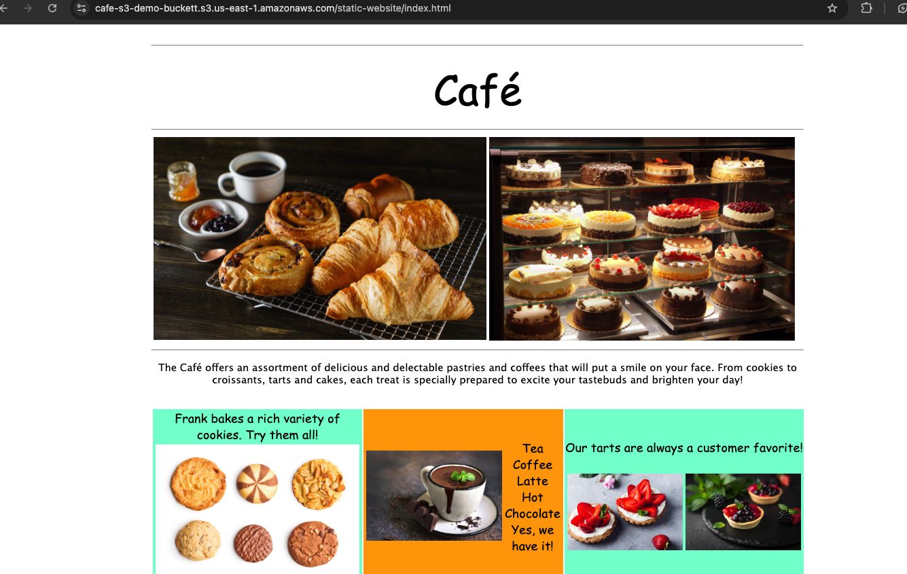

# Launching a static website

Note: the file uploaded to my S3 bucket can be found in the /static-website directory

## Creating an S3 bucket to host my static website
Here i will create an S3 bucket and configure it to host my static website.

- Opened the Amazon S3 console.
- Followed the **Create bucket** button to Created a bucket in my choice AWS Region. (I used **US East (N. Virginia) us-east-1**)

Note: I cleared the **Block all public access** and enabled **ACLs**.



- Edited and enabled static website hosting on my bucket in the properties tab after uploading my document, and chose the index.html file for my index document.



## Uploading content to my S3 bucket

- Uploaded the index.html file and the CSS and images folders to my S3 bucket.
- - In the **cafe-s3-demo-bucket** under **Objects**
- Select the index.hmtl file and click the **Copy url** button.
- In a separate web browser tab, opened the endpoint link for the static website.



Note: Aws follows the if not implicit allow, defaults to explicit deny. So allowing public access while creating the bucket does not cut it. We have to implicitly allow it in the bucket policy

## Creating a bucket policy to grant public read access

- Under Bukets, choose the name of the bucket, **cafe-s3-demo-bucket** in my case.
- Choose **Permissions** 
- Under **Bucket Policy** choose **Edit**
- To grant public read access for the website, copy the following bucket policy, and paste it in the Bucket policy editor.

```json
{
    "Version": "2012-10-17",
    "Statement": [
        {
            "Sid": "PublicReadGetObject",
            "Effect": "Allow",
            "Principal": "*",
            "Action": [
                "s3": "GetObject"
            ],
            "Resource": [
                "arn:aws:s3:::cafe-s3-demo-bucket/*"
            ]
        }
    ]
}
```


- In the **cafe-s3-demo-bucket** under **Objects**
- Select the index.hmtl file and click the **Copy url** button.
- In a separate web browser tab, opened the endpoint link for the static website., the website should be accessible now

