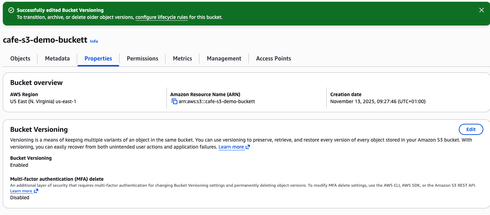
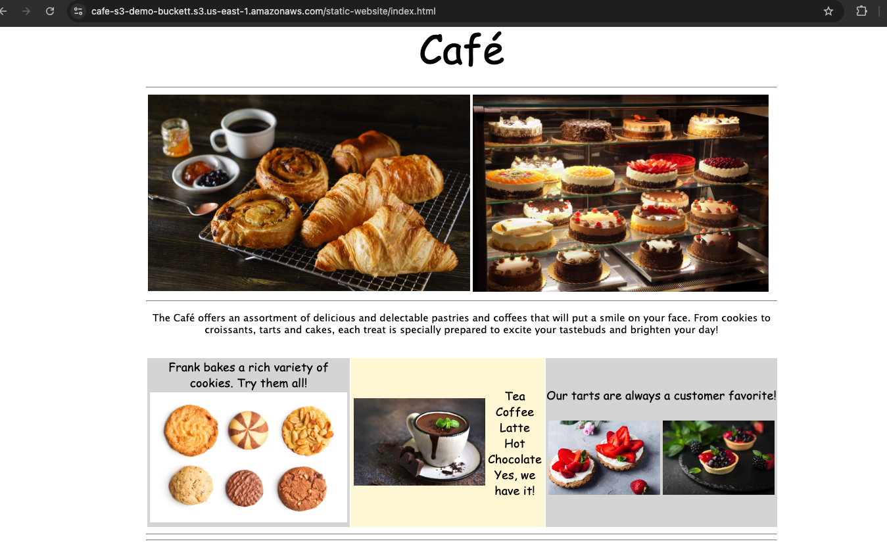
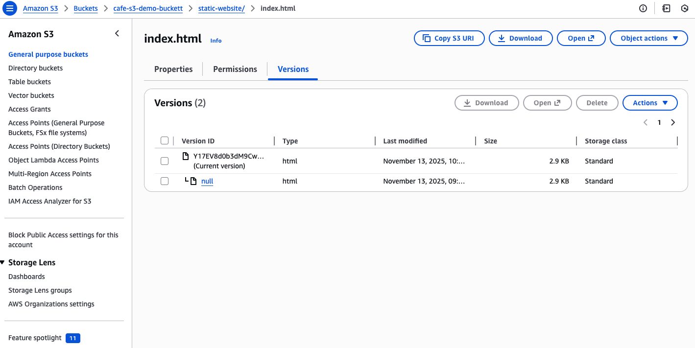

## Technical Lab Report: Protecting Website Data using Amazon S3 Versioning

### 1. Objective

The objective of this task was to implement **Amazon S3 Versioning** on the static website bucket to protect the data against accidental deletion or modification, and to verify its functionality by updating the main HTML file.

---

### 2. Procedure: Enabling and Testing Versioning

#### 2.1 Enabling S3 Versioning

1.  In the Amazon S3 console, the target bucket (`cafe-s3-demo-bucket`) was selected.
2.  Versioning was enabled on the S3 bucket to ensure that all future modifications or deletions retain a historical record of the object.

    

#### 2.2 Modifying and Uploading the New Version

1.  The local `index.html` file was opened in a text editor to simulate a website update.
2.  The following aesthetic changes were made to the embedded CSS background colors within the HTML file:
    * `bgcolor="aquamarine"` was changed to `bgcolor="gainsboro"`.
    * `bgcolor="orange"` was changed to `bgcolor="cornsilk"`.
    * The second instance of `bgcolor="aquamarine"` was changed to `bgcolor="gainsboro"`.
3.  The updated file was saved and uploaded to the S3 bucket, replacing the existing file.

#### 2.3 Verification of Website Change

1.  The web browser tab displaying the static website was reloaded.
2.  The changes were visible immediately on the website, confirming the new file version was being served.

    

---

### 3. ✅ Result: Confirming Versioning Functionality

1.  In the S3 console, the `index.html` file within the bucket was inspected.
2.  The **Show versions** toggle was activated.
3.  The S3 console correctly displayed **two distinct versions** of the `index.html` file:
    * The original file (prior to the modification).
    * The newly uploaded, modified file (the current version).

> **Conclusion:** The presence of both the current and previous versions confirms that S3 Versioning is successfully enabled and functioning, providing a history of object states and protection against data loss.

