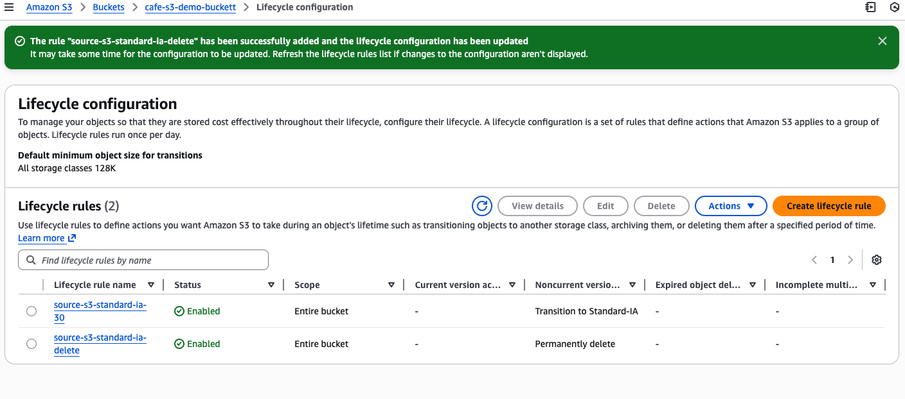

# Optimizing costs of Amazon S3 object storage
- Now that versioning is enabled, the size of the S3 bucket will continue to grow as new objects and versions are uploaded. To save costs, we implement a strategy to retire some of those older versions.

## Setting lifecycle policies
Here a lifecycle policy to automatically move older versions of the objects in your source bucket to S3 Standard-Infrequent Access (S3 Standard-IA) will be set. The policy should also eventually expire the objects.

- Configured two rules in the website bucket's lifecycle configuration. To receive full credit, create two separate rules. Do not configure two transitions in a single rule:
  - In one rule, move previous versions of all source bucket objects to S3 Standard-IA after 30 days.
  - In the other rule, delete previous versions of the objects after 365 days.

Note: To limit the scope of the replication to a particular bucket object (for example, the index.html file), create a tag for the object before you create the lifecycle rule.

