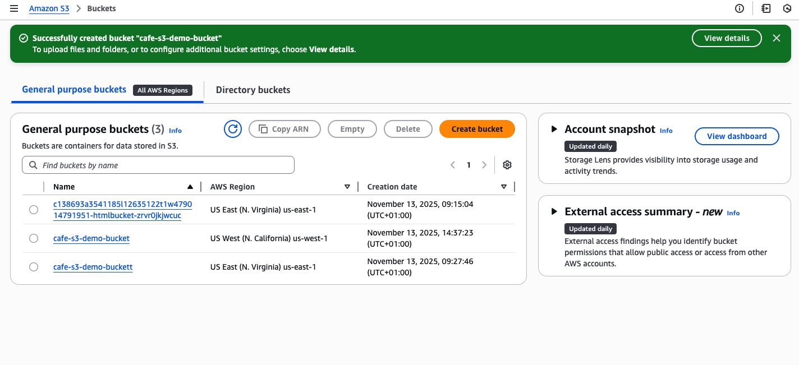
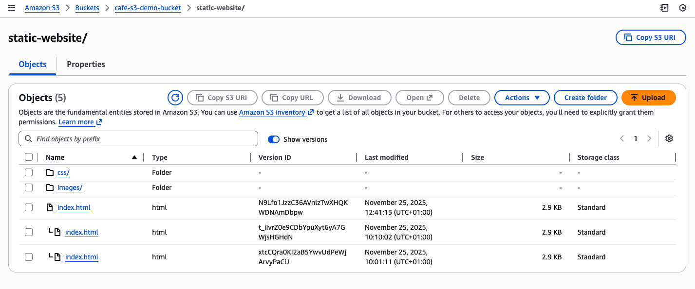

## Technical Lab Report: Enhancing Durability and Planning for Disaster Recovery (DR)

### 1. Objective

The objective of this task was to enhance data durability and implement a Disaster Recovery (DR) strategy by enabling **Amazon S3 Cross-Region Replication (CRR)** on the source bucket.

---

### 2. Procedure: Setting up Cross-Region Replication

#### 2.1 Destination Bucket Preparation

1.  A second S3 bucket, designated as the **Destination Bucket**, was created in a **different AWS Region** than the source bucket (e.g., US West (Oregon) if the source was US East (N. Virginia)).
2.  **Versioning was enabled** on the destination bucket, which is a mandatory prerequisite for CRR to function correctly.

    

#### 2.2 Configuring the Replication Rule

On the source S3 bucket, a new replication rule was configured with the following specifications:

* **Scope:** The rule was set to replicate the **entire source bucket**.
* **Existing Objects:** Replication was configured to **not replicate existing objects** (CRR only applies to objects uploaded after the rule is enabled).
* **IAM Role:** The custom **CafeRole** was specified. This role provides the necessary permissions for S3 to execute the replication process:
    * **Purpose of Role:** Allows S3 to read objects from the source bucket and write them to the destination bucket.
    * **Role Permissions Summary:**
        ```json
        Version: 2012-10-17
        Statement:
          - Action:
            - s3:ListBucket
            - s3:ReplicateObject
            - s3:ReplicateDelete
            - s3:ReplicateTags
            - s3:Get*
            Resource:
            - '*'
            Effect: Allow
        ```
    * **Note:** While the policy used was broad (`Resource: '*'`), in a production environment, the resource scope should be restricted to only the source and destination ARNs for security best practice (Principle of Least Privilege).

---

### 3. Verification of Replication

#### 3.1 Uploading a New Object Version

1.  A minor change was made to the local `index.html` file to generate a new object version.
2.  The new version of the file was uploaded to the **source bucket**.

#### 3.2 Confirming Versioning and Replication

1.  **Source Bucket Verification:** The source S3 bucket confirmed the update by displaying **three versions** of the `index.html` file, validating the Versioning and modification process.
    
2.  **Destination Bucket Verification:** The destination bucket was checked, and the new object was successfully replicated, confirming the functionality of the CRR rule.

> **Conclusion:** Cross-Region Replication was successfully enabled and verified. The setup provides continuous, asynchronous replication of new data, significantly enhancing the website's durability and providing a robust Disaster Recovery solution in a separate AWS Region.